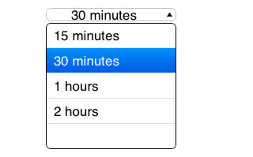

UIComboBox
===========
A simple ComboBox implement for iOS.
Using a UITableView to display the data.

## Usage
Add the following line to your application:

    UIComboBox *box = [[UIComboBox alloc] initWithFrame:CGRectMake(58, 202, 165, 37)];
    box.entries = @[@"xxxx", @"yyyy", @"zzzz", @"hhhh", @"wwww", @"aaaaa", @"bbbb"];
    box.selectedItem = 5;
    // box.delegate = self;
    [self.view addSubview:box];

## Supported OS
Tested in iOS 6.0, 7.0, 8.0 device and simulator

## LICENSE
Released in [MIT License](http://opensource.org/licenses/mit-license.php)
